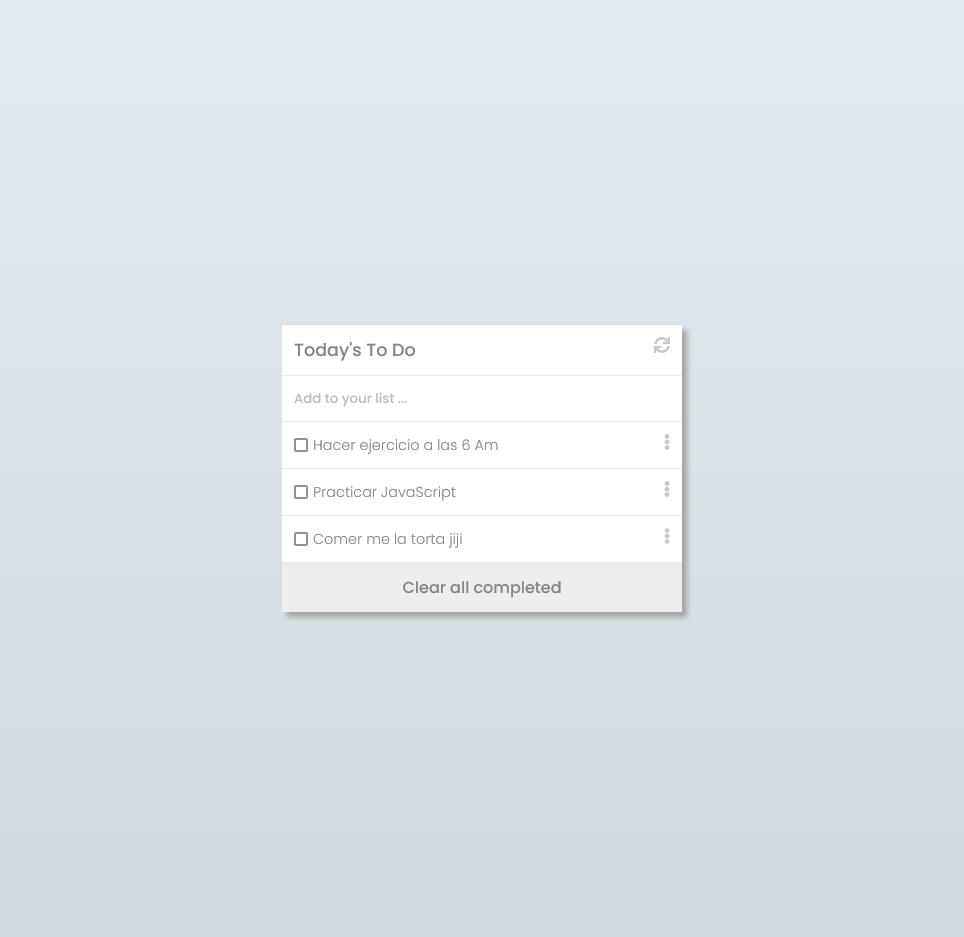

# Do-List-Project

> In this project we use Webpack dependecy and dynamic dome manipulation with for displaying into the webpack server a Do List project.

## Built with
* HTML-CSS-JS
* WebPack
* Node Modules
* GIT/GITHUB

## Project View

## Live page
- checkout the project page: [Do List]()

## Authors

👤 **Nicolas Gonzalez**
- Github: [Github](https://github.com/Nicolaswg)

## 🤝 Contributing

Contributions, issues, and feature requests are welcome!
Feel free to check leave recommendation in [issues page](https://github.com/Nicolaswg/Do-List-Project/issues)
